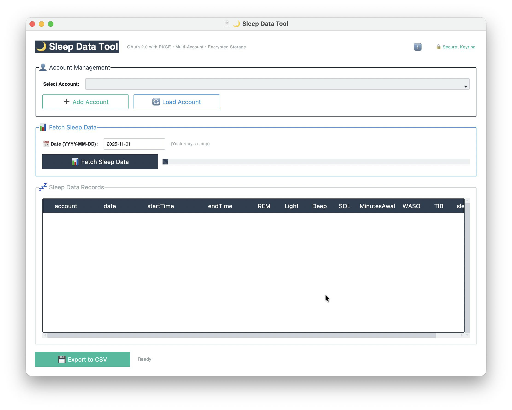

# 🌙 Sleep Data Tool

A modern, secure desktop application for fetching and exporting your sleep data with a graphical user interface.


## ✨ Features

- **🎨 Modern GUI** - Beautiful interface built with ttkbootstrap
- **🔐 Secure Authentication** - OAuth2 with PKCE (Proof Key for Code Exchange)
- **🔑 Encrypted Storage** - Tokens stored securely using OS keychain (Windows Credential Manager, macOS Keychain, Linux Secret Service)
- **👥 Multi-Account Support** - Manage and fetch data from multiple Fitbit accounts
- **📊 Sleep Data Export** - Export detailed sleep metrics to CSV format
- **⚡ Thread-Safe Operations** - Non-blocking UI with background data fetching
- **🔄 Auto Token Refresh** - Automatic token renewal when expired
- **🛡️ Rate Limit Handling** - Built-in retry logic for API rate limits
- **🎨 Theme Support** - Multiple UI themes available
- **📱 Cross-Platform** - Works on Windows, macOS, and Linux

### Sleep Metrics Tracked

- **REM Sleep** - Rapid Eye Movement sleep duration
- **Light Sleep** - Light sleep duration
- **Deep Sleep** - Deep sleep duration
- **SOL** - Sleep Onset Latency (time to fall asleep)
- **Minutes Awake** - Total time awake during sleep period (as provided by the API)
- **WASO** - Wake After Sleep Onset (calculated)
- **TIB** - Time In Bed
- **Sleep Type** - Type of sleep record (auto-detected, manual, etc.)
- **Source** - Data source information

<p align="center">
  
</p>

## ⚠️ Important Legal Notices

### Trademark Disclaimer
**Fitbit** is a registered trademark of Fitbit, Inc. (a Google company). This project is **NOT** affiliated with, endorsed by, sponsored by, or otherwise associated with Fitbit, Inc. or Google LLC in any way. This is an independent, third-party tool created for personal data export purposes only.

### Liability Disclaimer
**THIS SOFTWARE IS PROVIDED "AS IS", WITHOUT WARRANTY OF ANY KIND, EXPRESS OR IMPLIED, INCLUDING BUT NOT LIMITED TO THE WARRANTIES OF MERCHANTABILITY, FITNESS FOR A PARTICULAR PURPOSE AND NONINFRINGEMENT. IN NO EVENT SHALL THE AUTHORS OR COPYRIGHT HOLDERS BE LIABLE FOR ANY CLAIM, DAMAGES OR OTHER LIABILITY, WHETHER IN AN ACTION OF CONTRACT, TORT OR OTHERWISE, ARISING FROM, OUT OF OR IN CONNECTION WITH THE SOFTWARE OR THE USE OR OTHER DEALINGS IN THE SOFTWARE.**

**By using this software, you acknowledge and agree that:**
- You use this software entirely at your own risk
- The authors and contributors take no responsibility for any data loss, corruption, or unauthorized access
- The authors are not responsible for any violations of Fitbit's Terms of Service
- The authors are not liable for any damages, losses, or issues arising from the use of this software
- You are solely responsible for ensuring compliance with all applicable laws and terms of service
- This tool is provided for educational and personal data export purposes only

## 📋 Table of Contents

- [Features](#-features)
- [Prerequisites](#-prerequisites)
- [Installation Guide (Step-by-Step)](#-installation-guide-step-by-step)
  - [1. Install Python](#1-install-python)
  - [2. Download the Tool](#2-download-the-tool)
  - [3. Install Dependencies](#3-install-dependencies)
  - [4. Register a Fitbit Developer App](#4-register-a-fitbit-developer-app)
  - [5. Configure Environment Variables](#5-configure-environment-variables)
  - [6. Run the Application](#6-run-the-application)
- [Usage](#-usage)
- [Technical Features & Highlights](#-technical-features--highlights)
- [Project Structure](#-project-structure)
- [Troubleshooting](#-troubleshooting)
- [Security](#-security)
- [Contributing](#-contributing)
- [License](#-license)
- [Acknowledgments](#-acknowledgments)

## 📦 Prerequisites

Before you begin, ensure you have:

- **Python 3.10 or higher** installed on your computer
- A **Fitbit account** with sleep data
- **Internet connection** for OAuth authentication and API access
- Basic familiarity with using a terminal/command prompt (don't worry, we'll guide you!)

## 🚀 Installation Guide (Step-by-Step)

Follow these instructions carefully, even if you're not technical. Each step is explained in detail.

### 1. Install Python

#### Windows:

1. Go to [python.org/downloads](https://www.python.org/downloads/)
2. Download the latest Python 3.10+ installer (look for the big yellow button)
3. **IMPORTANT**: During installation, check the box that says "Add Python to PATH"
4. Click "Install Now"
5. Wait for installation to complete
6. Verify installation:
   - Open Command Prompt (press `Windows Key + R`, type `cmd`, press Enter)
   - Type: `python --version`
   - You should see something like `Python 3.10.x` or higher

#### macOS:

1. Open Terminal (press `Cmd + Space`, type "Terminal", press Enter)
2. Install Homebrew if you don't have it:
   ```bash
   /bin/bash -c "$(curl -fsSL https://raw.githubusercontent.com/Homebrew/install/HEAD/install.sh)"
   ```
3. Install Python:
   ```bash
   brew install python@3.10
   ```
4. Verify installation:
   ```bash
   python3 --version
   ```

#### Linux (Ubuntu/Debian):

```bash
sudo apt update
sudo apt install python3.10 python3-pip python3-tk
python3 --version
```

### 2. Download the Tool

#### Option A: Download ZIP (Easiest)

1. Click the green "Code" button at the top of this GitHub page
2. Select "Download ZIP"
3. Extract the ZIP file to a location you'll remember (e.g., `Documents/fitbit-sleep-tool`)

#### Option B: Using Git (If you have Git installed)

```bash
git clone https://github.com/YOUR_USERNAME/fitbit-sleep-tool.git
cd fitbit-sleep-tool
```

### 3. Install Dependencies

Now we need to install the required Python packages.

1. **Open your terminal/command prompt**
   - Windows: Command Prompt or PowerShell
   - macOS/Linux: Terminal

2. **Navigate to the tool's folder**
   ```bash
   cd path/to/fitbit-sleep-tool
   ```
   Replace `path/to/sleep-data-tool` with the actual path where you extracted the files

3. **Create requirements.txt file** (if not included)
   
   Create a file named `requirements.txt` with the following content:
   ```
   ttkbootstrap>=1.10.1
   requests>=2.31.0
   requests-oauthlib>=1.3.1
   pandas>=2.0.0
   pydantic>=2.0.0
   python-dotenv>=1.0.0
   cryptography>=41.0.0
   keyring>=24.0.0
   ```

4. **Install the dependencies**
   
   **Windows:**
   ```bash
   pip install -r requirements.txt
   ```
   
   **macOS/Linux:**
   ```bash
   pip3 install -r requirements.txt
   ```

5. **Wait for installation** - This may take a few minutes. You'll see progress bars and installation messages.

### 4. Register a Fitbit Developer App

You need to create a Fitbit Developer application to get your API credentials. Don't worry - it's free and straightforward!

1. **Go to Fitbit Developer Portal**
   - Visit: [dev.fitbit.com/apps](https://dev.fitbit.com/apps)
   - Log in with your Fitbit account

2. **Register a New App**
   - Click "Register a New App" button
   - Fill in the application details:

   ```
   Application Name:        My Fitbit Sleep Tool
   Description:             Personal sleep data export tool
   Application Website:     http://localhost:8080
   Organization:            Personal
   Organization Website:    http://localhost:8080
   Terms of Service URL:    http://localhost:8080
   Privacy Policy URL:      http://localhost:8080
   
   OAuth 2.0 Application Type:  Client
   
   Redirect URL:            http://localhost:8080/
                           (IMPORTANT: Must include trailing slash!)
   
   Default Access Type:     Read Only
   ```

3. **Important Settings**
   - **OAuth 2.0 Application Type**: Select **"Client"** (This is critical!)
   - Make sure to check the box accepting the terms of service

4. **Save Your Credentials**
   - After registration, you'll see your **Client ID**
   - Copy the Client ID - you'll need it in the next step
   - **Note**: For this type of app, there's no Client Secret (this is correct and expected)

5. **Screenshot your Client ID** or save it to a text file for safekeeping

### 5. Configure Environment Variables

Now we'll set up your app credentials so the tool can access Fitbit's API.

1. **Create a .env file**
   - In the same folder where `fitbit_sleep_tool.py` is located
   - Create a new file named exactly `.env` (note the dot at the beginning)
   
   **Windows users**: To create a `.env` file:
   - Open Notepad
   - Copy the content below and paste it
   - Go to File > Save As
   - In the "File name" field, type: `.env` (include the quotes)
   - In "Save as type", select "All Files (*.*)"
   - Click Save

2. **Add your configuration**
   
   Put the following content in your `.env` file:
   ```env
   # Fitbit API Configuration
   FITBIT_CLIENT_ID=your_client_id_here
   FITBIT_REDIRECT_URI=http://localhost:8080/
   
   # Optional: Set log level (DEBUG, INFO, WARNING, ERROR)
   LOG_LEVEL=INFO
   ```

3. **Replace the placeholder**
   - Replace `your_client_id_here` with your actual Client ID from step 4
   - Keep the quotes if present, or just paste the ID directly
   - Do NOT change `FITBIT_REDIRECT_URI` - it must match what you registered

4. **Example .env file**:
   ```env
   FITBIT_CLIENT_ID=23ABCD
   FITBIT_REDIRECT_URI=http://localhost:8080/
   LOG_LEVEL=INFO
   ```

5. **Save the file** and make sure it's named `.env` (not `.env.txt`)

### 6. Run the Application

You're ready to run the tool! 🎉

1. **Open terminal/command prompt** in the tool's directory

2. **Run the application**
   
   **Windows:**
   ```bash
   python fitbit_sleep_tool.py
   ```
   
   **macOS/Linux:**
   ```bash
   python3 fitbit_sleep_tool.py
   ```

3. **The GUI window should appear!** If you see the Fitbit Sleep Data Tool window, you've successfully installed everything!

## 📖 Usage

### First-Time Setup: Authenticate Your Account

1. **Launch the application** (see step 6 above)

2. **Add Your Fitbit Account**
   - Click the "**Add Account**" button
   - Enter a memorable name for this account (e.g., "MyFitbit" or your name)
   - Click OK

3. **OAuth Authentication**
   - Your default web browser will automatically open
   - You'll be taken to Fitbit's authorization page
   - **Log in** to your Fitbit account if prompted
   - **Click "Allow"** to grant access to your sleep data
   - You'll see a success message
   - **Return to the application** - authentication is complete!

4. **Your account is now saved** and tokens are securely stored

### Fetching Sleep Data

1. **Select your account** from the dropdown menu (if you have multiple)

2. **Enter a date** in YYYY-MM-DD format
   - Example: `2025-10-30`
   - Or use today's date by default

3. **Click "Fetch Data"**
   - The app will retrieve your sleep data for that date
   - Progress indicator will show while fetching
   - Data will appear in the table below

4. **View your sleep metrics** in the data table
   - Each row shows: Account, Date, Start Time, End Time, REM, Light, Deep, SOL, Awake Minutes, WASO, TIB, Sleep Type, and Source

### Exporting to CSV

1. **Fetch data** for all the dates you want to export

2. **Click "Export to CSV"**
   - Choose where to save the file
   - Give it a meaningful name (e.g., `my_sleep_data_october_2025.csv`)
   - Click Save

3. **Open with Excel or Google Sheets** to analyze your sleep patterns!

### Managing Multiple Accounts

- **Add Account**: Authenticate a new Fitbit account
- **Load Account**: Select and load a previously authenticated account
- **Remove Account**: Delete a saved account and its tokens

### Theme Customization

You can change the app theme by modifying line 1465 in `fitbit_sleep_tool.py`:

```python
themename="flatly"  # Try: darkly, flatly, litera, minty, pulse, superhero, etc.
```

Available themes: `darkly`, `flatly`, `litera`, `minty`, `pulse`, `superhero`, `solar`, `cyborg`, `journal`, `lumen`, `sandstone`, `sketchy`, `spacelab`, `united`, `vapor`, `yeti`

## 🔧 Technical Features & Highlights

### Architecture

- **Modern GUI Framework**: Built with `ttkbootstrap` for a polished, native look
- **Secure OAuth2 Flow**: Implements PKCE (Proof Key for Code Exchange) for enhanced security
- **Encrypted Token Storage**: Uses OS-level keychain services (platform-specific):
  - Windows: Windows Credential Manager
  - macOS: Keychain
  - Linux: Secret Service API (requires libsecret)
  - Fallback: AES-encrypted file storage with Fernet

### Security Features

- **No Client Secret Storage**: Configured as a "Client" OAuth app (public client)
- **Token Encryption**: All OAuth tokens encrypted at rest using Fernet symmetric encryption
- **Secure Key Management**: Encryption keys stored in OS keychain when available
- **Hashed Account Names**: Account identifiers are SHA-256 hashed in file storage
- **Token Auto-Refresh**: Automatic token renewal before expiration
- **Rate Limit Handling**: Exponential backoff and retry logic for API rate limits

### Code Quality

- **Type Safety**: Uses Pydantic models for data validation and type checking
- **Thread-Safe**: Background operations with proper locking mechanisms
- **Error Handling**: Comprehensive exception handling with user-friendly messages
- **Logging**: Configurable logging for debugging and monitoring
- **Input Validation**: Date format validation and sanitization
- **Platform Support**: Cross-platform compatibility (Windows, macOS, Linux)

### API Integration

- **Fitbit API v1.2**: Uses the latest sleep endpoint for detailed sleep stage data
- **Automatic Token Refresh**: Seamlessly refreshes expired access tokens
- **Rate Limit Aware**: Respects API rate limits with intelligent retry logic
- **Network Timeouts**: Configurable timeouts for all HTTP requests
- **OAuth 2.0 Compliant**: Full PKCE implementation for authorization code flow

### Data Model

Sleep records include:
- **Sleep Stages**: REM, Light, Deep sleep durations (minutes)
- **Sleep Quality Metrics**: SOL, WASO, Minutes Awake
- **Time Metrics**: Start time, end time, time in bed (TIB)
- **Metadata**: Sleep type, source information, account identifier

## 📁 Project Structure

```
sleep-data-tool/
│
├── fitbit_sleep_tool.py      # Main application script
├── requirements.txt           # Python dependencies
├── .env                       # Environment configuration (YOU create this)
├── README.md                  # This file
├── LICENSE                    # AGPL-3.0 license
│
├── fitbit_tokens/            # Created automatically - encrypted token storage
│   └── *.json                # Encrypted OAuth tokens (hashed filenames)
│
└── fitbit_key.key            # Created automatically - encryption key (if not using keyring)
```

**Important**: The `fitbit_tokens/` directory and `fitbit_key.key` file are created automatically when you first authenticate. Never share these files as they contain your authentication credentials!

## 🔍 Troubleshooting

### "pip is not recognized" or "pip: command not found"

**Solution**: Python wasn't added to PATH during installation.

- **Windows**: Reinstall Python and check "Add Python to PATH"
- **macOS/Linux**: Use `pip3` instead of `pip`

### "No module named 'ttkbootstrap'" or similar import errors

**Solution**: Dependencies weren't installed.

```bash
pip install -r requirements.txt
# or
pip3 install -r requirements.txt
```

### Browser doesn't open during OAuth authentication

**Solution**: Manually copy the URL from the console and paste it into your browser.

### "Invalid redirect_uri" error

**Solution**: Make sure your Fitbit app's Redirect URL exactly matches:
- `http://localhost:8080/` (with trailing slash!)
- Your `.env` file must have: `FITBIT_REDIRECT_URI=http://localhost:8080/`

### "Token validation error" or authentication fails

**Solutions**:
1. Delete the `fitbit_tokens/` folder
2. Re-authenticate your account through "Add Account"
3. Make sure your Fitbit app is set to "Client" type (not "Server")

### Port 8080 already in use

**Solution**: Another program is using port 8080. 

To use a different port:
1. Change the port in your Fitbit Developer App settings
2. Update your `.env` file: `FITBIT_REDIRECT_URI=http://localhost:8888/`
3. Modify `OAUTH_PORT = 8888` in the Python script (line 125)

### No sleep data found for a specific date

**Possible reasons**:
- No sleep was logged for that date in your Fitbit device
- Date is in the future
- Sync issue between device and Fitbit servers

**Solution**: Check your Fitbit app to confirm sleep data exists for that date

### macOS: "App can't be opened because it is from an unidentified developer"

**Solution**: This is normal for Python scripts.
- Right-click the script
- Select "Open With" > "Python Launcher"
- Or run from Terminal as shown in step 6

### Linux: Keyring errors

**Solution**: Install secret service support:

```bash
sudo apt install gnome-keyring libsecret-1-0
# or for KDE:
sudo apt install kwalletmanager
```

### Application crashes on startup

**Check**:
1. Python version is 3.10 or higher: `python --version`
2. All dependencies are installed: `pip list`
3. `.env` file exists and has correct format
4. Check console output for specific error messages

**Enable debug logging**:
In your `.env` file, set: `LOG_LEVEL=DEBUG`

## 🔒 Security

### Best Practices

- **Never share** your `.env` file - it contains your API credentials
- **Never share** the `fitbit_tokens/` folder - it contains your access tokens
- **Never share** your `fitbit_key.key` file - it's used to decrypt your tokens
- **Keep your system updated** - ensure OS-level keychain services are up to date
- **Use Personal OAuth** - This tool is designed for personal use only
- **Review permissions** - Only grant "Read Only" access when authenticating

### What Gets Stored

- **Encrypted OAuth Tokens**: Stored in `fitbit_tokens/` directory
- **Encryption Key**: Stored in OS keychain (preferred) or `fitbit_key.key` file
- **No Passwords**: Your Fitbit password is never stored or accessed by this tool
- **Local Only**: All data stays on your computer - nothing is sent to third parties

### Data Privacy

This tool:
- ✅ Runs entirely on your local machine
- ✅ Only communicates with Fitbit's official API
- ✅ Stores all tokens locally and encrypted
- ✅ Never sends your data to any third-party services
- ❌ Does not collect analytics or telemetry
- ❌ Does not share your data with anyone

## 🤝 Contributing

Contributions are welcome! Please follow these guidelines:

1. **Fork the repository**
2. **Create a feature branch** (`git checkout -b feature/amazing-feature`)
3. **Commit your changes** (`git commit -m 'Add amazing feature'`)
4. **Push to the branch** (`git push origin feature/amazing-feature`)
5. **Open a Pull Request**

### Development Setup

```bash
# Clone your fork
git clone https://github.com/YOUR_USERNAME/fitbit-sleep-tool.git
cd fitbit-sleep-tool

# Create virtual environment
python -m venv venv
source venv/bin/activate  # On Windows: venv\Scripts\activate

# Install dependencies
pip install -r requirements.txt

# Run in development mode
python fitbit_sleep_tool.py
```

### Code Style

- Follow PEP 8 guidelines
- Use type hints where possible
- Add docstrings to all functions and classes
- Keep functions focused and modular

## 📄 License

This project is licensed under the **GNU Affero General Public License v3.0 (AGPL-3.0)**.

### What This Means

- ✅ You can use this software for personal and commercial purposes
- ✅ You can modify the source code
- ✅ You can distribute the software
- ✅ You can use it privately
- ⚠️ **If you modify and distribute** this software, you must:
  - Disclose your source code
  - Use the same AGPL-3.0 license
  - State your changes
  - Include the original copyright
- ⚠️ **If you run a modified version** as a service/web application:
  - You must make your modified source code available to users

For the full license text, see the [LICENSE](LICENSE) file or visit:
https://www.gnu.org/licenses/agpl-3.0.en.html

### Why AGPL?

AGPL-3.0 ensures that any improvements or modifications to this tool benefit the entire community, even when the software is used as a service. This protects user freedoms and promotes open source development.

## ⚖️ Disclaimer & Legal

### Software Disclaimer

THIS SOFTWARE IS PROVIDED "AS IS" AND "AS AVAILABLE," WITHOUT WARRANTY OF ANY KIND, EXPRESS OR IMPLIED, INCLUDING BUT NOT LIMITED TO THE WARRANTIES OF MERCHANTABILITY, FITNESS FOR A PARTICULAR PURPOSE, TITLE, AND NON-INFRINGEMENT.

IN NO EVENT SHALL THE COPYRIGHT HOLDERS OR CONTRIBUTORS BE LIABLE FOR ANY DIRECT, INDIRECT, INCIDENTAL, SPECIAL, EXEMPLARY, OR CONSEQUENTIAL DAMAGES (INCLUDING, BUT NOT LIMITED TO, PROCUREMENT OF SUBSTITUTE GOODS OR SERVICES; LOSS OF USE, DATA, OR PROFITS; OR BUSINESS INTERRUPTION) HOWEVER CAUSED AND ON ANY THEORY OF LIABILITY, WHETHER IN CONTRACT, STRICT LIABILITY, OR TORT (INCLUDING NEGLIGENCE OR OTHERWISE) ARISING IN ANY WAY OUT OF THE USE OF THIS SOFTWARE, EVEN IF ADVISED OF THE POSSIBILITY OF SUCH DAMAGE.

### Terms of Use Compliance

By using this software, you acknowledge and agree that:

1. **You are responsible** for compliance with Fitbit's Terms of Service and API Terms
2. **You will not** use this tool to violate any applicable laws or regulations
3. **You will not** use this tool to access data you don't have permission to access
4. **You use** this tool entirely at your own risk
5. **You understand** that improper use may result in Fitbit account suspension
6. **The authors** provide this tool for educational and personal data access purposes only

### Third-Party Services

This software interacts with Fitbit's API services. Your use of Fitbit services is subject to:
- [Fitbit Terms of Service](https://www.fitbit.com/global/us/legal/terms-of-service)
- [Fitbit Privacy Policy](https://www.fitbit.com/global/us/legal/privacy-policy)
- [Fitbit Developer Terms](https://dev.fitbit.com/legal/platform-terms-of-service/)

### Data Responsibility

- **Your data security is your responsibility**
- Keep your API credentials secure
- Do not share authentication tokens
- Regularly review your authorized applications in Fitbit settings
- The authors are not responsible for any data breaches or unauthorized access

### No Warranty

THE AUTHORS PROVIDE NO WARRANTY:
- That the software will function without interruption or errors
- That defects will be corrected
- That the software will meet your requirements
- Regarding the accuracy or reliability of data retrieved
- That the software is compatible with all systems or configurations

### Limitation of Liability

TO THE MAXIMUM EXTENT PERMITTED BY LAW, THE AUTHORS SHALL NOT BE LIABLE FOR ANY DAMAGES WHATSOEVER INCLUDING, WITHOUT LIMITATION, DAMAGES FOR LOSS OF BUSINESS PROFITS, BUSINESS INTERRUPTION, LOSS OF BUSINESS INFORMATION, DATA LOSS, OR ANY OTHER PECUNIARY LOSS ARISING OUT OF THE USE OF OR INABILITY TO USE THIS SOFTWARE.

## 🙏 Acknowledgments

### Third-Party Libraries

This project uses the following open-source libraries:

- **[ttkbootstrap](https://github.com/israel-dryer/ttkbootstrap)** - Modern themed Tkinter widgets
- **[requests](https://github.com/psf/requests)** - HTTP library
- **[requests-oauthlib](https://github.com/requests/requests-oauthlib)** - OAuth authentication
- **[pandas](https://github.com/pandas-dev/pandas)** - Data manipulation and CSV export
- **[pydantic](https://github.com/pydantic/pydantic)** - Data validation
- **[cryptography](https://github.com/pyca/cryptography)** - Encryption for token storage
- **[keyring](https://github.com/jaraco/keyring)** - OS-level credential storage
- **[python-dotenv](https://github.com/theskumar/python-dotenv)** - Environment variable management

Thank you to all the maintainers and contributors of these excellent projects!

## 📞 Support

### Getting Help

- **Issues**: Report bugs or request features via [GitHub Issues](https://github.com/apob-100/sleep-data-tool/issues)
- **Discussions**: Ask questions in [GitHub Discussions](https://github.com/apob-100/sleep-data-tool/discussions)
- **Documentation**: Check this README and inline code documentation

### Before Opening an Issue

Please:
1. Check existing issues to avoid duplicates
2. Include your Python version (`python --version`)
3. Include your operating system
4. Describe steps to reproduce the problem
5. Include relevant log output (set `LOG_LEVEL=DEBUG` in `.env`)
6. **Never include** your Client ID, tokens, or `.env` file contents

### Useful Links

- [Fitbit Developer Documentation](https://dev.fitbit.com/build/reference/)
- [Python Official Documentation](https://docs.python.org/3/)
- [OAuth 2.0 PKCE Flow](https://oauth.net/2/pkce/)

---

## 📈 Version History

### v1.0.0 (Current)
- Initial release
- OAuth2 with PKCE authentication
- Multi-account support
- Encrypted token storage with OS keychain
- Sleep data fetching and CSV export
- Modern ttkbootstrap GUI
- Cross-platform support (Windows, macOS, Linux)

---

*Remember: Your data is yours. This tool helps you access it securely and privately.*

---

### Star this repository ⭐ if you find it useful!
